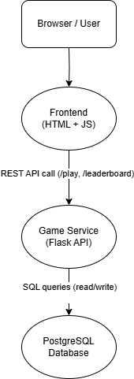
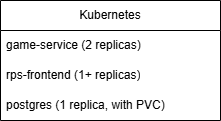

# Rock Paper Scissors App

A web-based Rock Paper Scissors. It features:

- Frontend interface (HTML + JavaScript)
- Flask-based backend providing a REST API
- PostgreSQL database with persistent storage

- Play against the best RPS computer in the worlds RockPaperFish (estimated ELO of 3000+) or another player
- Scoreboard to track top players

---

## Architecture

---

Frontend + Game Service Docker images are pushed to Docker Hub: https://hub.docker.com/u/sebe20

# How to deploy RPS

# Apply all
kubectl apply -f k8s/

# Start port-forwarding in two terminals:
kubectl port-forward deployment/game-service 5002:5002
kubectl port-forward deployment/rps-frontend 8080:80

# RPS should now be accessible at:
http://localhost:8080

There are security concerns, most importantly, the game service and the database are not protected by any authentication or authorization mechanisms. These issues would have to be solved before production deployment. The game service validates the choice of the player but not the name, so it's at big risk of an SQL injection.
